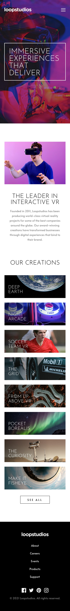

<h1 align="center">PROJETO FRONTENDMENTOR LOOPSTUDIOS 

 <h1 align='center'></h1>

### projeto criado com o objetivo de mostrar meus conhecimentos em Reactjs.

- Deve se ajustar aos tamanhos de tela do usuario.
- Deve ser o mais parecido com o original
- O usuario Veja os estados de foco para todos os elementos interativos na página.

## Recursos

 - React
 - Fontweasome
 - Images(jpg,svg) fornecidos pro frontendmentor

 
 <h1 align='center'></h1>